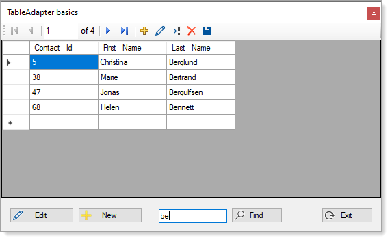

# About

Working with TableAdapter basics.

### Filtering

In this case filtering is performed using the BindingSource.Filter. There are two examples, one on button click and the other on text changed for the TextBox.

```
ContactsBindingSource.Filter = $"LastName LIKE '%{LastNameContainsTextBox.Text}%'"
```


